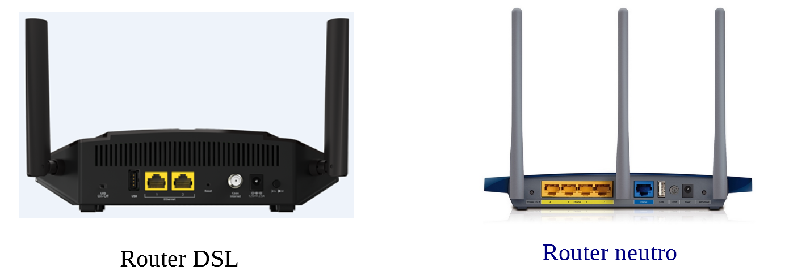

## ¿Qué es un router neutro?¿En qué se diferencia con un router DSL?

Si necesitas ayudas puedes consultarlo a este [página](https://www.rankia.com/foros/internet-telefonia-movil/temas/2930289-router-neutro-que-para-sirve)

1. ¿Con qué interfaz se conecta al lado WAN en un router DSL?¿Y en un router neutro?

2. ¿Se puede tener conexiones al red pública solo con el router neutro?

3. Cuando contratamos a una linea de Internet nos instala un router en nuestro casa.¿Que tipo de router crees que es?

4. ¿Cómo conectamos el router neutro con el router DSL para que tiene acceso al red público?

5. ¿Por qué nos interesa instalar un router neutro?

[Ir al siguiente actividad](ActividadRQ5.2.md) | [Volver al Página de inicio](inicio.md)
