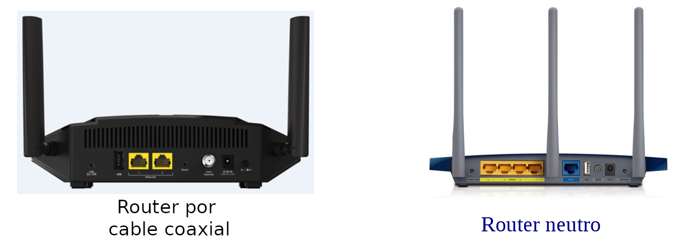

## ¿Qué es un router neutro?

Si necesitas ayudas puedes consultarlo a este [página](https://www.rankia.com/foros/internet-telefonia-movil/temas/2930289-router-neutro-que-para-sirve)

1. ¿Qué diferencias ves entre un router DSL(el router que nos instala las empresas de red) con un router neutro?

2. ¿Con qué interfaz se conecta al lado WAN?

3. ¿Se puede tener conexiones al red pública solo con el router neutro?

4. ¿Cómo conectamos el router neutro con el router DSL para que tiene acceso al red público?

5. ¿Por qué nos interesa instalar un router neutro?

[Ir al siguiente actividad](ActividadRQ5.2.md) | [Volver al Página de inicio](inicio.md)
