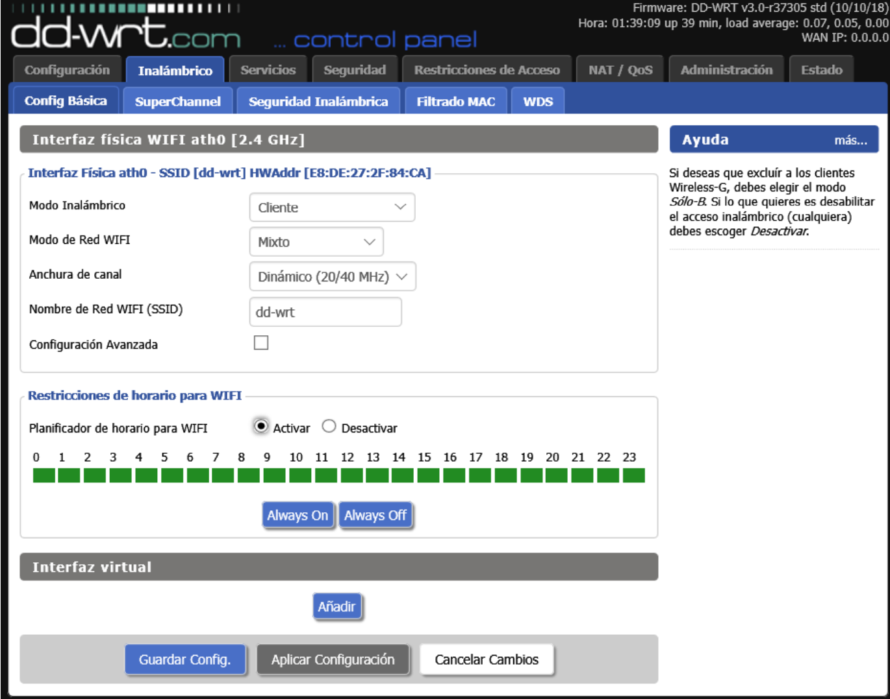

## Configuración de un router neutro

Sabiendo los beneficios que nos proporciona un router neutro hemos instalado uno, y vamos a configurar uno.

Para ello podemos entrar al página de configuración o instalar el programa de configuración. Podemos consultar al manual (para saber que programa a instalar) o ver etiqueta que está parte trasera del router (para saber como acceder al página de configuración).

Vamos a entrar con el ip del router (por defecto es **192.168.1.1**), o entramos con el dominio del página. Entramos a una página con una vista en general los configuraciones del router.

En  apartado de **Administración** podemos cambiar el idioma de la página.

En configuración podemos cambiar el nombre , ip del router, servidor dhcp, etc. Además disponemos unas **notas de ayuda** por parte derecha que nos ayuda a saber la función de cada opción.

El servidor DHCP

En el apartado inalámbrico podemos configurar lo como los puntos de accesos. En los router DSL son muy parecidos solo que no nos proporciona tantos opciones.

Para proteger mejor nuestro WIFI seleccionamos WPA2 PSK con cifrado AES y le ponemos una clave.

Y ya tenemos el router neutro configurado. Además de esos podemos toquetear un poco más para tener un mayor seguridad del red.

[La práctica siguiente](ActividadRQ5.3.md) | [Volver al Página de inicio](inicio.md)
