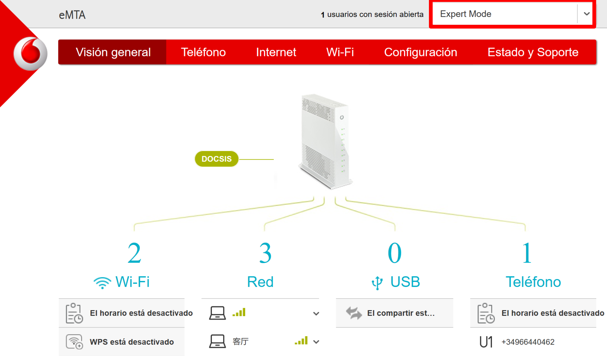
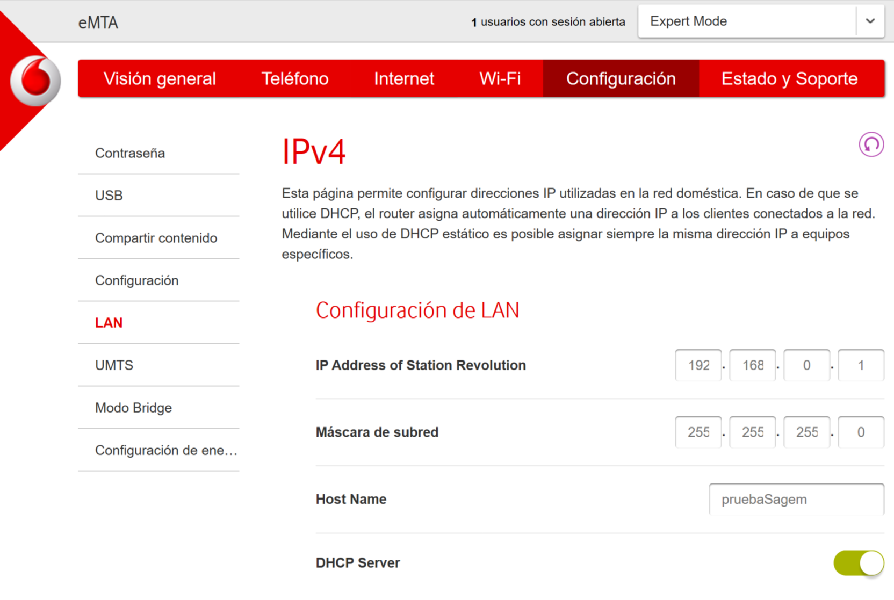
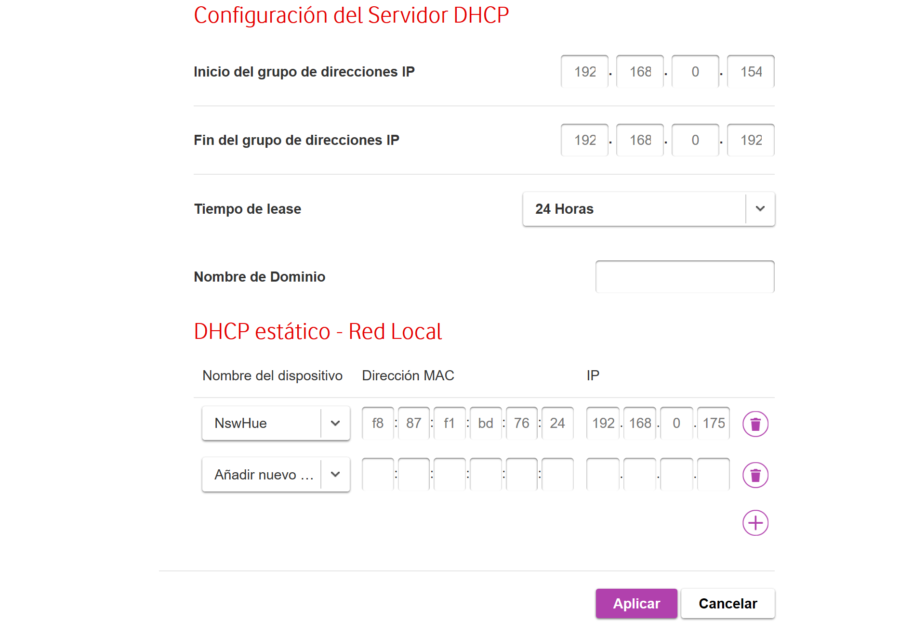
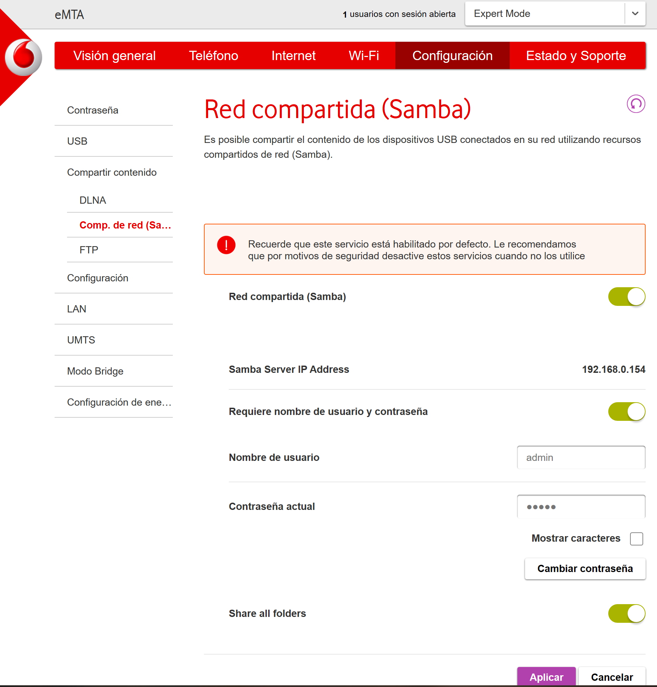
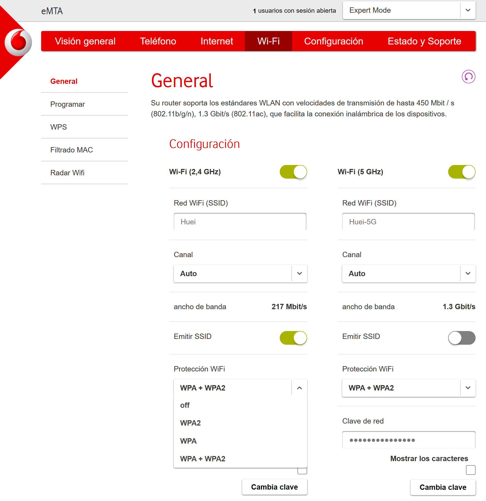
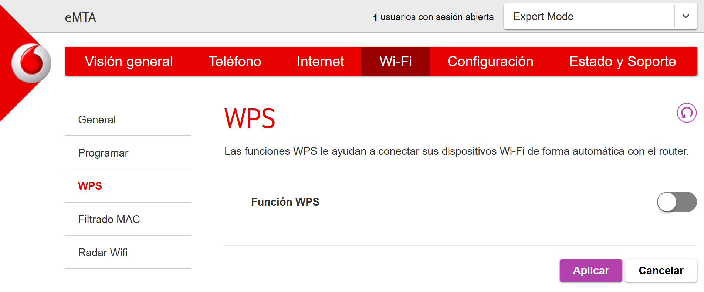
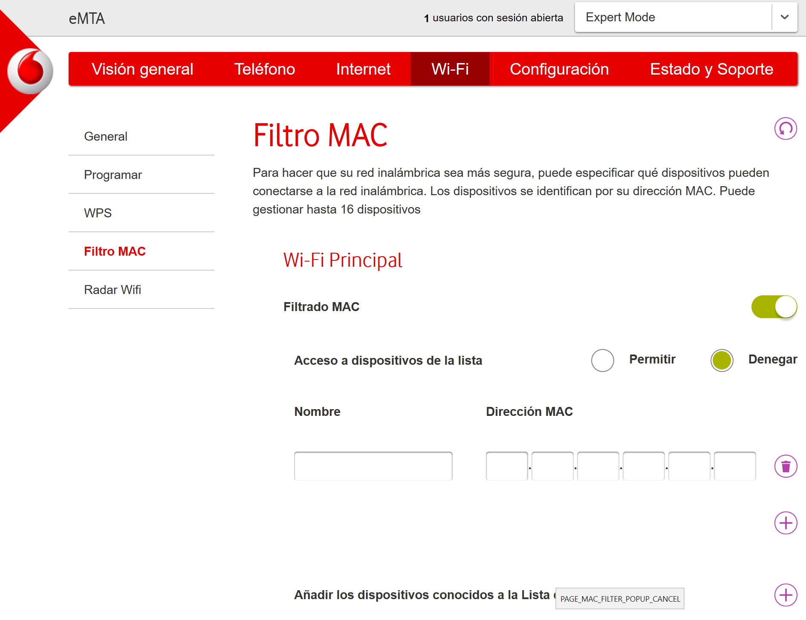

## Configurar router de tu casa.

Tras los actividades anteriores ya sabemos la configuración del router ahora vamos a probarlo configurando el router de tu casa. Por ejemplo el tiempo de concesión, el pool, nombre del señal WLAN(ESSID),etc.
**No cambia los configuraciones** que no te aclaras, podría causar graves problemas.

### Ejemplo:

En la página web de mi router lleva un resumen de los equipos conectados a tu router organizado por tipo de conexión. Además nos permite renombrar los equipos para poder localizarla fácilmente.Para que nos aparezca más opciones entramos al modo experto (en el parte derecha superior de la página).

En configuración-LAN configuramos los parámetros del router.

El servidor DHCP (pool, timepo de confeción e IP estático o reservado)
Como podeis ver las opciones de configuración son bastante menos que en un router neutro. En un router neutro tenemos un control total de él y en un router DSL solo los que nos permite el comercial.

En apartado de WIFI podemos toquetear un poco la configuración sobre neustro red WIFI. 

Es recomendable cambiar el nombre del nombre y la contraseña del señal WIFI. Los canales podemos configurarlo a una canal que no lleva tanto interferencia para mejorar el rendimiento del WIFI (para más información sobre eso consulta al [medir_cobertura](https://serrogard.github.io/Se-al-WiFi/)). El tipo de cifrado lo dejamos en WPA2.

También podemos añadir un filtro de mac (hasta 16 equipos). "Permitir" permite el acceso al red **solamente** los equipos que están en la lista (conectado con WIFI). "Denegar" no permite el acceso al red de los equipos cuyo mac que están en la lista. Podemos añadir equipos con el mac, si ya está conectado al red nos facilita la introducción de mac.

En configuración-LAN configuramos el ip del router, y el servidor DHCP (pool, timepo de confeción e IP estático o reservado)
Como podeis ver las opciones de configuración son bastante menos que en un router neutro. En un router neutro tenemos un control total de él y en un router DSL solo los que nos permite el comercial.

Una vez terminado no te olvides salvarlo para aplicar los cambios.
Si queréis saber más informaciones sobre los recomendaciones de seguridad he os he propuesto puedes ver esta actividad "[Hackear la contraseña wifi](https://nswhuei.github.io/hack-wifi/)"

[Volver al Página de inicio](inicio.md)
