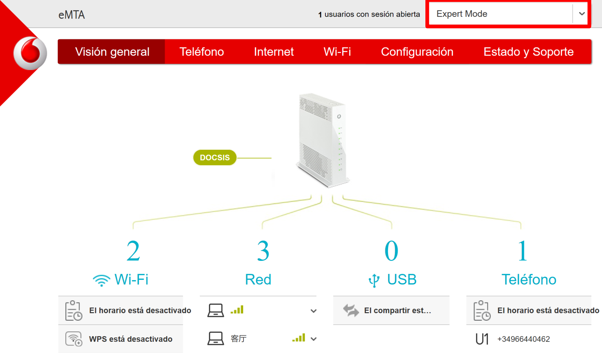
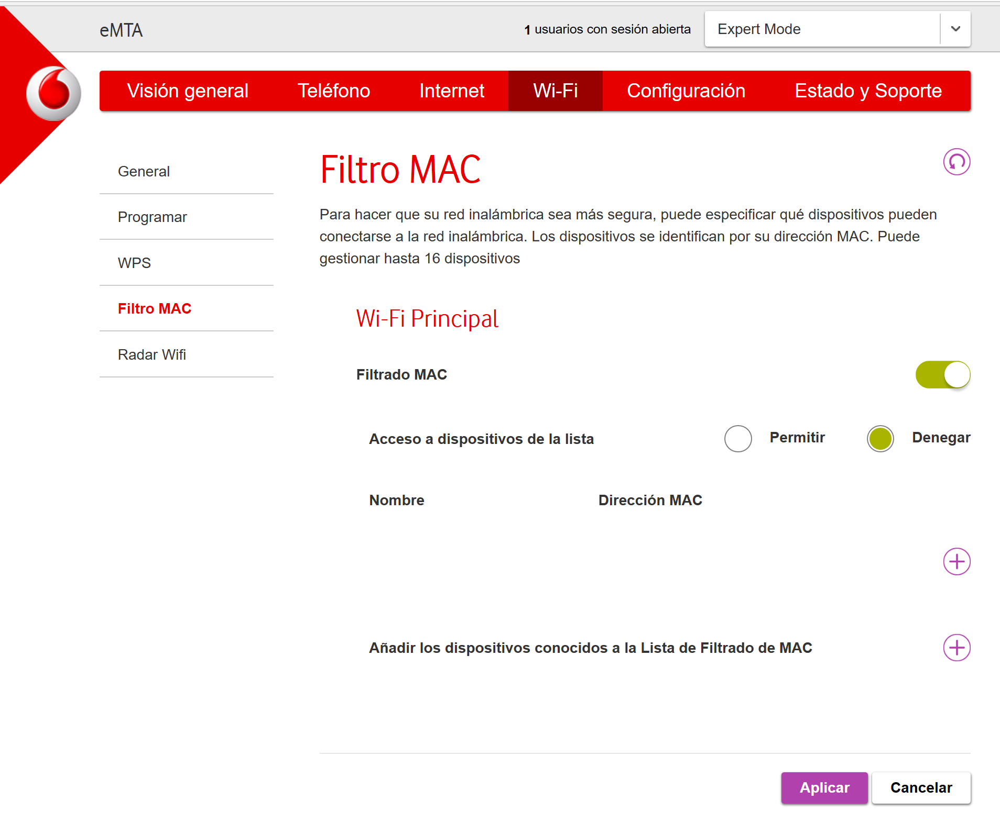
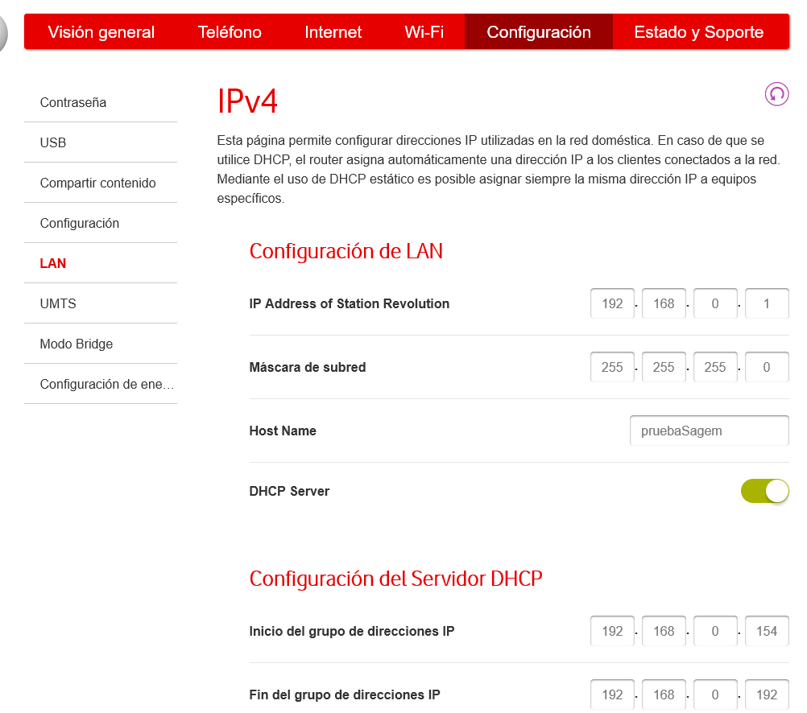
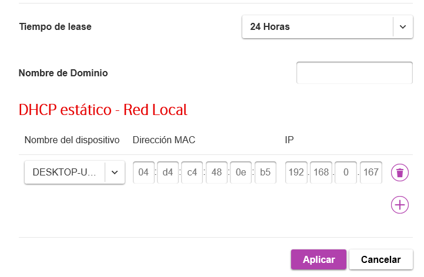

## Configurar router de tu casa

Tras los actividades anteriores ya sabemos la configuración del router ahora vamos a probarlo configurando el router de tu casa. Por ejemplo el tiempo de concesión, el pool, nombre del señal WLAN(ESSID),etc.
**No cambia los configuraciones** que no te aclaras, podría causar graves problemas

### Ejemplo

Lleva un resumen de equipos conectados a tu router y con qué método. Además nos permite renombrar los equipos(del resumen) para poder localizar fácilmente.

En apartado de WIFI nos permite configurar los servicios de WIFI. Para que nos aparezca más opciones entramos al modo experto(derecha arriba de la página).

Es recomendable cambiar el nombre del nombre y la contraseña del señal WIFI. Los canales podemos configurarlo a una canal que no lleva tanto interferencia para mejorar el rendimiento del WIFI (para más información sobre eso consulta al [medir_cobertura]()). El tipo de cifrado lo dejamos en WPA2.

Nos proporciona dos tipo de filtro que pueden gestionar hasta 32 macs. "Permitir" permite los accesos al red **solamente** los equipos que están en la lista (conectado con WIFI). "Permitir" niega los accesos al red de los equipos cuyo mac que están en la lista. Podemos añadir equipos con el mac, si ya está conectado al red nos facilita la introducción de mac.

En configuración-LAN configuramos el ip del router, y el servidor DHCP (pool, timepo de confeción e IP estático o reservado)

Como podeis ver las opciones de configuración son bastante menos que en un router neutro. En un router neutro tenemos un control total de él y en un router DSL solo los que nos permite el comercial.

Una vez terminado no te olvides salvarlo para aplicar los cambios.

[Volver al Página de inicio](inicio.md)
