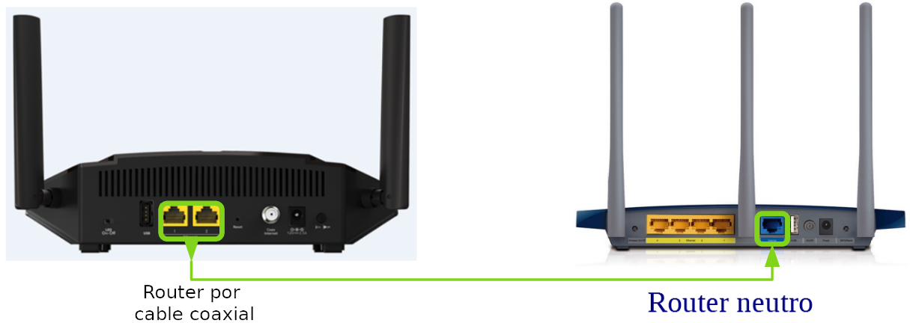

## ¿Qué es un router neutro?¿En qué se diferencia con un router DSL?

Estas son los tipos de cableado de redes que más utilizamos.

1. Cuando contratamos a una linea de Internet nos instala un router en nuestro casa.¿Con qué tipo de cabelado se conecta al router?

 * Con el Cable coaxial.

2. ¿Podemos conectar este tipo de cable a un router neutro (fijando la image)?

  * No, ya que no son iguales los conectores de cada cable.

3. 3. ¿Se puede tener conexiones al Internet si solamente tenemos instalado un router neutro?
  * No, las companía de telefónico normalmente nos instala la red mediante cable coaxial o fibra óptica (según el cable que nos instala desde calle). Y en un router neutro su interfaz wan solo soporta el cable rj45 que normalmente lo conecamos al interfaz lan del router DSL para obtener conexión al red pública.

4. ¿Cómo conectamos el router neutro con el router DSL para que tiene acceso al red público?
  * Conectamos con un cable RJ45 a interfaz WAN del router neutro e interfaz LAN del router DSL
  

5. ¿Qué nos mejora instalando un router neutro?Respuesta abierta.
  * Nos proporciona un mejor rendimiento del WIFI: "mayor cobertura", mayor número de equipos conectado...
  * Nos permite configurarlo más cerca a nuestro uso (en rl router DSL no hay tanto opción).
  * Mayor nivel de seguridad, como tiene más opción de configuración podemos configurarlo con más seguridad (requiere un mayor nivel de redes).
  * Como todos los router nos permite segmentar la red, si te interesa algunos equipos no están en el mismo segmento de red con los otros para más control. Por ejemplo crear una red SAN.
  * No permite hacer más filtrado de macs.
  * Según el fabricante del router nos proporciona unos software para mejorar la experiencia de uso.

[Volver al actividad](ActividadRQ5.1.md)  |  [Ir al siguiente actividad](ActividadRQ5.2.md)  | [Volver al Página de inicio](inicio.md)
